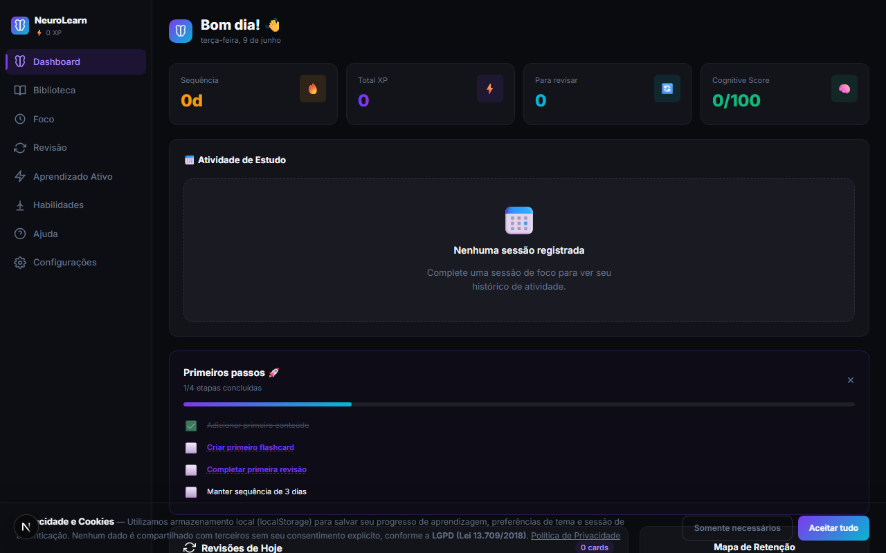
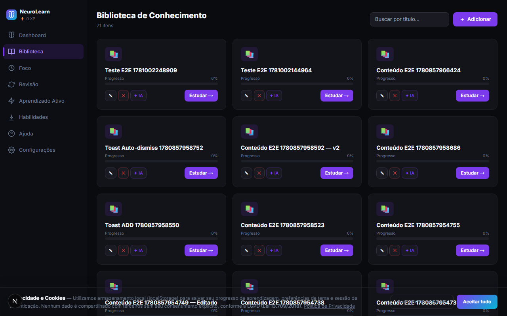
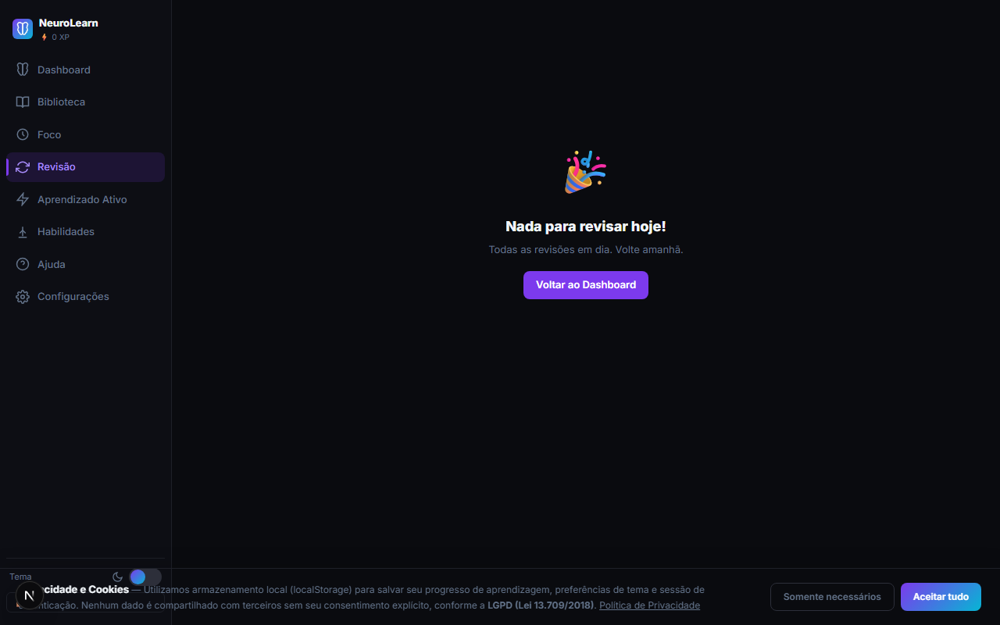
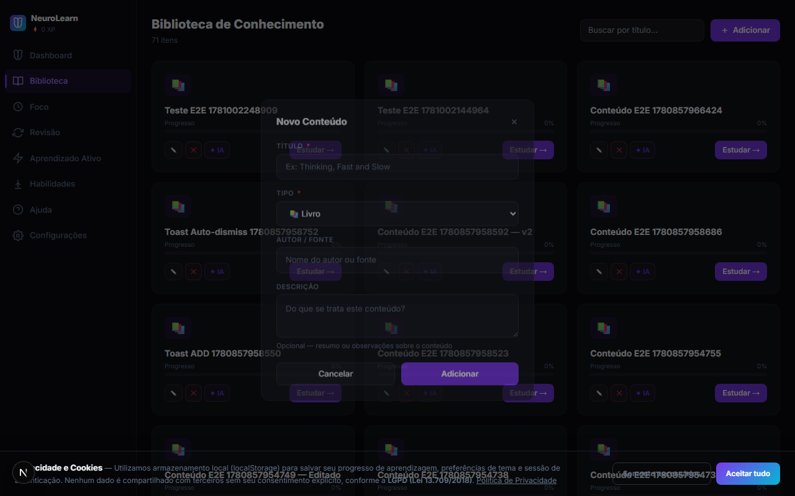
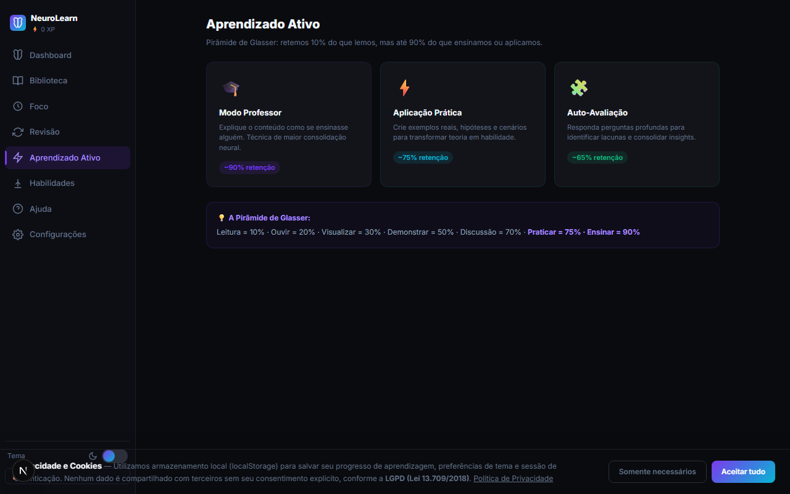
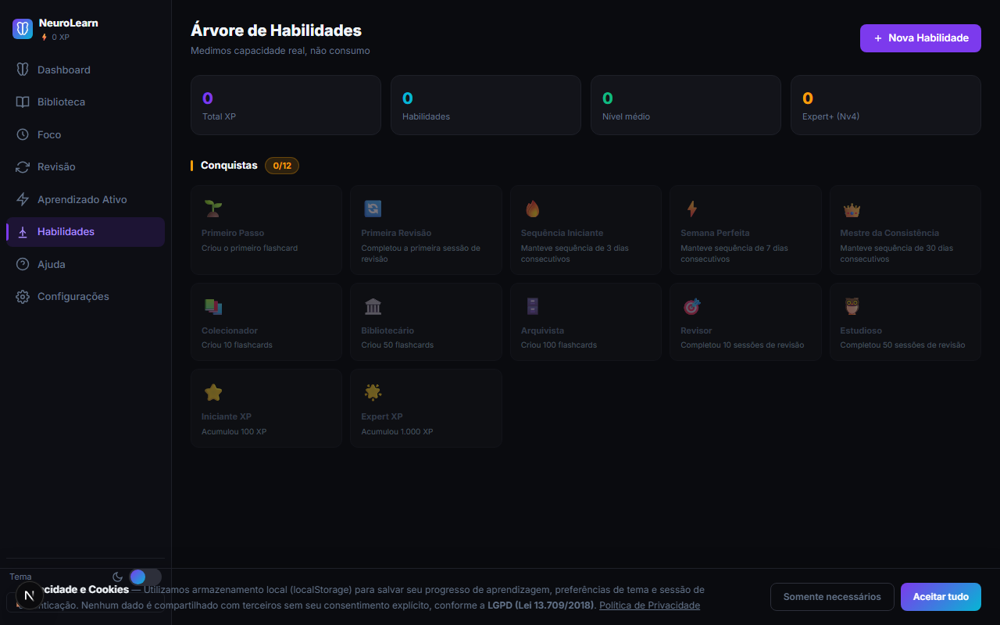

# NeuroLearn — Guia Oficial de Uso

**Versão:** 3.0  
**Última atualização:** 2026-06-08

---

> ## *"Você não tem problema de acesso ao conhecimento.*
> ## *Você tem um problema de retenção.*
> ## *O NeuroLearn resolve isso."*

---

# Bem-vindo ao seu Sistema Operacional de Aprendizagem

Este guia vai te acompanhar do primeiro acesso até o domínio completo da plataforma.  
Não precisa ler tudo de uma vez. Vá no seu ritmo — cada seção está aqui quando você precisar.

---

# 1. O que é o NeuroLearn?

## O problema que todo estudante tem

Você já leu um livro inteiro e, um mês depois, não conseguia lembrar quase nada?  
Terminou um curso e ficou se perguntando: *"Eu realmente aprendi isso?"*

Isso não é falha sua. É como o cérebro humano funciona.

Sem o método certo, estudar é como encher um balde furado.

## O que o NeuroLearn faz diferente

O NeuroLearn combina três pilares da neurociência da aprendizagem em um único lugar:

| Pilar | O que é | Por que funciona |
|---|---|---|
| 🔄 **Revisão Espaçada** | Revisa no momento exato antes de você esquecer | Força o cérebro a reconsolidar a memória |
| 🧠 **Aprendizado Ativo** | Você explica, aplica e testa o que aprendeu | Retenção até 9× maior que leitura passiva |
| 📊 **Progresso Visível** | Métricas reais de retenção e domínio | Você sabe exatamente onde está e para onde vai |

## O resultado na prática

- Você para de **acumular** conteúdo sem reter.
- Você começa a **construir** conhecimento real e durável.
- Cada sessão de estudo vale muito mais.

> 💡 **Conceito rápido:** A Pirâmide de Glasser mostra que retemos apenas 10% do que lemos — mas até 90% do que ensinamos ou aplicamos. O NeuroLearn foi construído em torno disso.

---

# 2. Primeiros Passos

## 2.1 Criando sua conta

Você não precisa criar senha. O NeuroLearn usa **Magic Link** — um método mais simples e mais seguro.

### Passo a passo

**1.** Acesse **neurolearn.tech** e clique em **"Criar conta"**.

**2.** Preencha:
- **Nome** — como quer ser chamado na plataforma
- **E-mail** — onde você vai receber o link de acesso

**3.** Clique em **"Criar conta"** e aguarde a confirmação na tela.

**4.** Abra seu e-mail. Você receberá uma mensagem do NeuroLearn com o assunto **"Seu acesso ao NeuroLearn"**. Clique no botão **"Acessar agora"**.

**5.** Pronto — você estará dentro da plataforma, sem precisar criar ou lembrar de senha.

> ⏱️ **Tempo total:** menos de 2 minutos.

---

### O que é o Magic Link?

É um link único, enviado para o seu e-mail, que faz o login automaticamente quando você clica. É mais seguro do que senha porque:

- Não existe senha para vazar
- Cada link funciona uma única vez
- O link expira em **1 hora** — se não usar a tempo, é só solicitar outro

---

## 2.2 Fazendo login depois

Quando quiser acessar novamente:

**1.** Acesse neurolearn.tech e clique em **"Entrar"**.

**2.** Digite seu e-mail e clique em **"Enviar Magic Link"**.

**3.** Abra seu e-mail e clique no link recebido.

Você entra automaticamente.

> 📱 **Dica:** Se você instalar o NeuroLearn como app (veja a Seção 12), vai entrar direto sem precisar do navegador.

---

## 2.3 Sua jornada começa aqui

Quando entrar pela primeira vez, você verá o **Dashboard** — a tela principal da plataforma.

Para começar a usar o NeuroLearn de verdade, o fluxo ideal é:

```
Biblioteca → Adicionar conteúdo
     ↓
Foco → Estudar e criar flashcards
     ↓
Revisão → Revisar no momento certo
     ↓
Aprendizado Ativo → Consolidar o conhecimento
     ↓
Dashboard → Acompanhar seu progresso
```

Não precisa fazer tudo hoje. Um passo de cada vez.

---

# 3. Dashboard — Sua Central de Aprendizagem

O **Dashboard** é o painel de controle do seu aprendizado. Quando você abre o NeuroLearn, é aqui que chega.



---

## 3.1 Saudação e data

No topo, o NeuroLearn te cumprimenta com **Bom dia**, **Boa tarde** ou **Boa noite**, seguido da data atual. É um lembrete de que o sistema acompanha seu ritmo diário.

---

## 3.2 Métricas Rápidas

Logo abaixo da saudação, quatro indicadores resumem sua situação atual:

| Indicador | O que significa |
|---|---|
| 🔥 **Sequência** | Quantos dias consecutivos você está estudando. Não quebre a sequência! |
| ⚡ **Total XP** | Sua experiência acumulada — cresce com cada sessão, revisão e prática |
| 🃏 **Flashcards** | Total de cards criados na sua biblioteca |
| 🧠 **Cognitive Score** | Sua pontuação cognitiva geral (0–100) — combina retenção, consistência e aprendizado ativo |

> 🎯 **Meta saudável:** Cognitive Score acima de **70** significa que você está aprendendo de forma eficiente.

---

## 3.3 Revisões de Hoje

Esta é a seção mais importante do dia.

O NeuroLearn calcula automaticamente quais flashcards precisam ser revisados agora. Você verá:

- Quantos cards estão **pendentes**
- De **quais conteúdos** eles vêm
- Um botão **"Revisar agora"** para começar imediatamente

> ⚠️ **Regra de ouro:** Sempre revise antes de estudar algo novo. O esforço é pequeno, o impacto na retenção é enorme.

---

## 3.4 Cards em Risco

São os flashcards que você está **prestes a esquecer** — calculados com base no modelo de decaimento da memória.

Se não revisados a tempo, eles retrocedem no sistema. Quanto mais cedo você os revisar, mais fácil será reconsolidar.

---

## 3.5 Atividade de Estudo (Heat Map)

Um calendário visual que mostra **quais dias você estudou** nas últimas semanas.

Quadrados mais escuros = mais sessões naquele dia. É uma visualização direta da sua consistência.

> 💡 **Por que consistência importa mais do que intensidade?** Estudar 15 minutos por dia, 7 dias na semana, é muito mais eficaz do que 2 horas no sábado. O cérebro consolida memórias durante o sono entre as sessões.

---

## 3.6 Tendência de Retenção

Um gráfico que mostra como o seu **Cognitive Score** evoluiu ao longo do tempo.

- Linha subindo = você está consolidando conhecimento
- Linha caindo = algum ciclo de revisão foi quebrado — hora de retomar

---

## 3.7 Domínio por Conteúdo

Mostra quanto você domina **cada conteúdo** da sua biblioteca, baseado nos níveis de mastery dos seus flashcards.

Use isso para decidir onde focar nos próximos dias.

---

## 3.8 Mapa de Retenção

Visão geral de **quanto você está retendo** de cada assunto.

Conteúdos com baixa retenção precisam de mais revisão. Conteúdos com alta retenção podem ficar em segundo plano por enquanto.

---

## 3.9 Habilidades

Um resumo das habilidades que você está desenvolvendo e o progresso atual de cada uma. Clique em **"Árvore de Habilidades →"** para ver o detalhe completo.

---

# 4. Biblioteca — Tudo que Você Está Aprendendo

A **Biblioteca** é onde você registra os conteúdos que estuda: livros, cursos, vídeos, artigos, podcasts, anotações.



---

## 4.1 Adicionando um conteúdo

**1.** Clique em **"Biblioteca"** no menu lateral.

**2.** Clique no botão **"+ Adicionar conteúdo"** no topo da página.

**3.** Preencha o formulário:

| Campo | O que preencher | Obrigatório? |
|---|---|---|
| **Título** | Nome do livro, curso, vídeo ou material | ✅ Sim |
| **Tipo** | Livro, Curso, Vídeo, Artigo, Nota ou Outro | ✅ Sim |
| **Autor** | Quem criou o conteúdo | Não |
| **Descrição** | Um resumo do que você espera aprender | Não |

**4.** Clique em **"Adicionar"**.

O conteúdo aparece na sua biblioteca instantaneamente.

---

## 4.2 Editando e removendo

Em cada card da biblioteca, você encontra opções para:

- ✏️ **Editar** — corrigir título, autor ou descrição
- 🗑️ **Remover** — excluir o conteúdo **e todos os flashcards associados**

> ⚠️ **Atenção:** Remover um conteúdo não pode ser desfeito. Se tiver muitos flashcards valiosos nele, considere apenas editar em vez de excluir.

---

## 4.3 Buscando na biblioteca

Na parte superior da Biblioteca, há um campo de busca. Digite o título ou autor para filtrar seus conteúdos em tempo real.

---

## 4.4 Dica de organização

> 📌 **Uma regra simples:** Um registro por livro ou curso. Não misture assuntos diferentes em um único conteúdo. Isso mantém seus flashcards organizados e as métricas de progresso precisas.

---

# 5. Sessão de Foco — Estudar com Intenção

A **Sessão de Foco** é o ambiente de estudo do NeuroLearn. É onde você lê, anota, cria flashcards e registra seu tempo.

> 📸 *[Imagem: Tela de Sessão de Foco com timer Pomodoro, área de anotações e seção de highlights]*

---

## 5.1 Iniciando uma sessão

**1.** Vá em **Foco** no menu lateral.

**2.** Selecione o conteúdo que quer estudar.

**3.** A sessão começa automaticamente com o **timer Pomodoro de 25 minutos**.

---

## 5.2 O Timer Pomodoro

O método Pomodoro divide o estudo em blocos de **25 minutos de foco + 5 minutos de pausa**.

Por que isso funciona? Porque o cérebro mantém atenção plena por períodos curtos. Tentar estudar por 2 horas sem parar resulta em rendimento decrescente — você está lendo, mas não processando.

O timer avança automaticamente. Você não precisa gerenciar nada.

---

## 5.3 Anotações

Na área central da sessão, há um campo de texto livre.

Use para:
- Pontos principais do que está estudando
- Perguntas que surgem durante a leitura
- Conexões com conhecimentos anteriores
- Insights e reflexões

Tudo que você anota aqui fica salvo na sessão.

---

## 5.4 Highlights

O campo de **Highlights** serve para marcar as frases ou conceitos mais importantes.

**Como adicionar um highlight:**

1. Digite o trecho no campo de highlights
2. Pressione `Enter` ou clique no botão **"+"**
3. O highlight aparece listado abaixo

Os highlights ficam visíveis na sessão e podem ser usados depois para gerar flashcards com IA.

---

## 5.5 Criando Flashcards durante a sessão

Esta é uma das ações mais valiosas que você pode fazer.

Clique em **"🃏 Criar Flashcards"** para abrir o formulário de criação rápida:

**Frente:** a pergunta ou conceito  
**Verso:** a resposta ou explicação

> 💡 **Dica de ouro:** Crie o flashcard imediatamente quando entender algo. Não espere terminar o capítulo — a memória está fresca agora.

---

## 5.6 Finalizando a sessão

Quando terminar, clique em **"✓ Finalizar e Salvar Sessão"**.

O sistema registra:
- Duração total
- Highlights criados
- Flashcards adicionados
- Notas salvas

Isso alimenta as métricas do Dashboard.

---

# 6. Revisão Inteligente — O Coração do NeuroLearn

A **Revisão** é onde acontece a consolidação real do conhecimento.



---

## 6.1 Como funciona a revisão espaçada

Existe uma coisa chamada **curva do esquecimento**, descoberta pelo psicólogo Hermann Ebbinghaus no século XIX.

Ela mostra que esquecemos de forma previsível:
- Perdemos ~50% do conteúdo em **1 hora**
- Até ~70% em **24 horas**
- Mais de **90%** em uma semana — se não revisarmos

Mas existe um antídoto: revisar **logo antes de esquecer**.

Quando você revisa no momento ideal, o cérebro reconsolida a memória e a mantém por mais tempo. Com o tempo, os intervalos ficam cada vez maiores.

```
Revisão 1 → intervalo de 1 dia
Revisão 2 → intervalo de 3 dias
Revisão 3 → intervalo de 1 semana
Revisão 4 → intervalo de 3 semanas
Revisão 5 → intervalo de 2 meses
...
```

O NeuroLearn gerencia todos esses intervalos automaticamente, para cada flashcard, com base no seu histórico de respostas.

---

## 6.2 Como revisar

**1.** Clique em **Revisão** no menu lateral.

**2.** O card aparece com a **Frente** (a pergunta ou conceito).

**3.** Tente responder mentalmente — não vale pular!

**4.** Pressione `Espaço` ou clique em **"Revelar"** para ver a resposta.

**5.** Avalie com honestidade:

| Avaliação | Quando usar | O que acontece |
|---|---|---|
| **1 — Não lembrei** | Não veio nada à mente | Revisão em breve (1–3 dias) |
| **2 — Difícil** | Lembrei com muita dificuldade | Revisão em poucos dias |
| **3 — Bom** | Lembrei com alguma hesitação | Intervalo normal |
| **4 — Fácil** | Lembrei sem esforço | Intervalo maior |
| **Perfeito** | Imediato e preciso | Intervalo longo |

---

## 6.3 Atalhos de teclado na revisão

| Ação | Tecla |
|---|---|
| Revelar resposta | `Espaço` ou `Enter` |
| Avaliar "Não lembrei" | `1` |
| Avaliar "Difícil" | `2` |
| Avaliar "Bom" | `3` |
| Avaliar "Fácil" | `4` |
| Desfazer avaliação | `Backspace` |

> 💡 **Dica de produtividade:** Use os atalhos de teclado. Você consegue revisar 3× mais rápido sem precisar usar o mouse.

---

## 6.4 Resultado da sessão de revisão

Ao terminar todos os cards do dia, você vê uma tela de resultado com:

- **Cognitive Score antes × depois** — o impacto da revisão no seu score
- Cards revisados e acertos
- Cards que ainda precisam de atenção

---

## 6.5 Seja honesto na avaliação

Esta é a regra mais importante da revisão:

> 🚫 **Não marque "Fácil" quando foi difícil.** Parece um atalho, mas prejudica você. O sistema vai diminuir a frequência de revisão — e você vai esquecer mais rápido. A única pessoa que você está enganando é você mesmo.

---

# 7. Flashcards Inteligentes

Os flashcards são a unidade básica do aprendizado no NeuroLearn. São perguntas e respostas que você cria sobre o que estudou.



---

## 7.1 O que é um bom flashcard

A chave não é ter muitos flashcards — é ter os **certos**.

| ❌ Evite | ✅ Prefira |
|---|---|
| Respostas longas com 5 linhas | Uma ideia por flashcard |
| "O que é o Método X?" (genérico) | "Em uma frase: o Método X serve para ___" |
| Copiar e colar definições do livro | Escrever com suas próprias palavras |
| Perguntas vagas | Perguntas específicas e testáveis |

---

## 7.2 Onde criar flashcards

Você pode criar flashcards em dois lugares:

1. **Durante uma Sessão de Foco** — clique em **"🃏 Criar Flashcards"** (recomendado)
2. **Na Biblioteca** — acesse o conteúdo e use a opção de gerenciar flashcards

---

## 7.3 Níveis de mastery

Cada flashcard tem um nível de domínio que evolui com as revisões:

| Nível | O que significa |
|---|---|
| 🆕 **Novo** | Criado recentemente, ainda não revisado |
| 📖 **Aprendendo** | Em processo de consolidação — revisado poucas vezes |
| 🔄 **Revisão** | Já conhecido, mas ainda em ciclo ativo |
| 💪 **Dominado** | Memória forte — revisado com sucesso várias vezes |

O Dashboard e o Quiz Adaptativo usam esses níveis para priorizar o que você precisa ver com mais urgência.

---

## 7.4 Geração de flashcards com IA

Durante uma Sessão de Foco, se você tiver anotações e highlights, pode usar a **IA para gerar flashcards automaticamente**.

O sistema analisa suas notas e sugere cards bem formulados baseados no que você estudou.

> 💡 **Dica:** Revise os flashcards gerados pela IA antes de confirmar. Edite os que não estiverem com suas palavras — flashcards escritos por você têm maior retenção.

---

# 8. Aprendizado Ativo — Do Conhecimento ao Domínio

A revisão garante que você não esqueça. O **Aprendizado Ativo** é o que transforma conhecimento passivo em domínio real.

Acesse pelo menu lateral em **"Aprendizado Ativo"**.



Você verá três modos, cada um com um nível diferente de engajamento cognitivo:

---

## 8.1 🎓 Modo Professor — até 90% de retenção

> *"Quem ensina, aprende duas vezes."*

Este modo aplica a **Técnica Feynman**: explicar um conceito como se estivesse ensinando alguém que nunca ouviu sobre o assunto.

Quando você tenta ensinar algo, seu cérebro identifica as lacunas — o que você acha que sabe, mas não sabe de verdade.

### Como usar

**1.** Clique em **"Aprendizado Ativo"** no menu.

**2.** Selecione **"🎓 Modo Professor"**.

**3.** Escolha um conteúdo da sua biblioteca.

**4.** Escreva sua explicação do conteúdo (mínimo 100 caracteres).

**5.** Quando terminar, clique em **"Analisar com IA"**.

### O que a IA avalia

A IA analisa sua explicação e entrega um relatório com:

| Métrica | O que mede |
|---|---|
| **Clareza** (0–100) | Quão fácil de entender está sua explicação |
| **Cobertura** (0–100) | Quantos aspectos importantes você abordou |
| **Pontos fortes** | O que você explicou bem |
| **Lacunas identificadas** | O que ficou faltando na sua explicação |
| **Sugestões** | Como melhorar |
| **Retenção estimada** | Previsão de quanto você vai reter a longo prazo |

> 📸 *[Imagem: Painel de análise do Modo Professor com scores, lacunas e sugestões da IA]*

---

## 8.2 ⚡ Aplicação Prática — até 75% de retenção

Transforme teoria em habilidade. Em vez de só entender o conceito, você cria **exemplos reais, hipóteses e cenários** baseados no que aprendeu.

### Como usar

**1.** Selecione **"⚡ Aplicação Prática"**.

**2.** Escolha um conteúdo.

**3.** Responda ao prompt proposto:
- *"Como aplicaria isso no seu trabalho nos próximos 7 dias?"*
- *"Crie uma hipótese ou experimento baseado no que aprendeu."*
- *"Crie um exemplo concreto e real usando o conhecimento."*

**4.** Clique em **"Salvar prática"** — você ganha **XP** proporcional ao que escreveu.

> 💡 **Dica:** Não precisa ser perfeito. O objetivo é forçar seu cérebro a fazer conexões entre o que aprendeu e o mundo real. Esse esforço é o que solidifica o conhecimento.

---

## 8.3 🧩 Auto-Avaliação (Quiz Adaptativo) — até 65% de retenção

O Quiz Adaptativo usa **IA para criar perguntas de múltipla escolha** baseadas nos seus próprios flashcards — com distratores plausíveis que testam se você realmente entendeu, não só memorizou.

O quiz é **adaptativo**: ele prioriza os flashcards que você ainda não domina. Cards marcados como "Novo" ou "Aprendendo" aparecem antes dos já dominados.

### Como usar

**1.** Selecione **"🧩 Auto-Avaliação"**.

**2.** Escolha um conteúdo da sua biblioteca.
> ⚠️ É preciso ter flashcards criados para esse conteúdo.

**3.** Aguarde alguns segundos enquanto a IA monta as perguntas.

**4.** Responda cada pergunta clicando em uma das opções.

**5.** Após cada resposta, você vê imediatamente:
- ✅ Se acertou (destacado em verde)
- ❌ Se errou (opção errada em vermelho, certa em verde)

**6.** Clique em **"Próxima →"** para avançar.

**7.** Ao fim, você vê:
- **Placar:** X/Y corretas
- **XP ganho:** 10 XP por acerto
- **Cards para revisar:** lista dos que você errou

> 📸 *[Imagem: Quiz em andamento com pergunta, quatro opções e barra de progresso no topo]*

---

# 9. Habilidades — Evolução que Você Pode Ver

O NeuroLearn não mede apenas o que você sabe. Mede o que você **consegue fazer**.

A seção de **Habilidades** é onde você registra e acompanha as competências que está desenvolvendo.



---

## 9.1 Categorias de habilidades

Você pode adicionar habilidades em qualquer categoria:

| Categoria | Exemplos |
|---|---|
| 💻 **Tecnologia** | Python, React, Machine Learning, Cloud |
| 🎯 **Produto** | Product Management, UX Research, Roadmap |
| 💬 **Soft Skills** | Liderança, Comunicação, Negociação |
| 📊 **Dados** | SQL, Análise de dados, Visualização |
| 💼 **Negócios** | Finanças, Marketing, Estratégia |
| 🎨 **Design** | UI Design, Motion, Branding |
| 🌍 **Idiomas** | Inglês, Espanhol, Alemão |
| 🔬 **Ciências** | Biologia, Física, Química |

---

## 9.2 Adicionando uma habilidade

**1.** Clique em **"Habilidades"** no menu lateral.

**2.** Role até **"+ Adicionar habilidade"** e preencha:
- **Nome** — ex: "Python", "Comunicação Executiva"
- **Categoria** — escolha a que melhor representa

**3.** Salve. A habilidade aparece no seu painel.

---

## 9.3 Como a habilidade evolui

Conforme você estuda conteúdos relacionados, revisita flashcards e pratica no Aprendizado Ativo, você ganha **XP** que alimenta suas habilidades.

Dentro de cada card de habilidade:

| Indicador | O que significa |
|---|---|
| **Nv. 0–4** | Nível atual — cresce conforme você acumula XP |
| **Barra de XP** | Progresso dentro do nível atual |
| **+10 XP** / **+25 XP** | Botões para registrar prática manual |

---

## 9.4 Conquistas

Conforme você evolui, o NeuroLearn desbloqueia **badges de conquista** automaticamente.

> 📸 *[Imagem: Grade de conquistas com badges desbloqueados e bloqueados]*

Há 12 conquistas no total, que reconhecem marcos como:
- Criar seu primeiro flashcard
- Manter uma sequência de estudos
- Atingir alta retenção
- Completar revisões consecutivas
- Chegar a marcos de XP

Quando uma conquista é desbloqueada, você recebe uma notificação de celebração.

> 🏆 **Contador:** A tela mostra quantas conquistas você já desbloqueou no formato **X/12**.

---

# 10. Dashboard Cognitivo — Entendendo Seu Progresso

O Dashboard combina todas as métricas do seu aprendizado em um único painel. Vamos entender o que cada número significa.

---

## 10.1 O Cognitive Score

O **Cognitive Score** (0–100) é o indicador mais completo do seu progresso.

Ele combina quatro dimensões:

| Dimensão | O que mede | Peso |
|---|---|---|
| 🔄 **Retenção** | Quanto você está retendo do que estudou | Alto |
| 🎯 **Mastery** | Nível médio de domínio dos seus flashcards | Alto |
| 📅 **Consistência** | Regularidade das suas revisões | Médio |
| ⚡ **Aprendizado Ativo** | Frequência de práticas no modo ativo | Médio |

**Como interpretar:**

| Score | Significado |
|---|---|
| 0–40 | Iniciando — continue consistente |
| 41–60 | Em desenvolvimento — bom ritmo |
| 61–79 | Bom desempenho — consolidação sólida |
| 80–89 | Ótimo — retenção alta e consistente |
| 90–100 | Excelente — domínio de alto nível |

> 💡 **Não se preocupe com o score hoje.** O que importa é a **tendência**. Um score subindo, mesmo que devagar, significa que o método está funcionando.

---

## 10.2 Retenção

Mostra a porcentagem do conteúdo que você ainda lembra, com base no modelo de decaimento da memória.

- 100% = todos os flashcards foram revisados no tempo certo
- Abaixo de 70% = alguns cards precisam de revisão urgente

---

## 10.3 Cards em risco

São os flashcards com maior probabilidade de esquecimento no curto prazo.

O NeuroLearn busca esses dados em tempo real do banco de dados para garantir precisão — não são estimativas locais.

---

## 10.4 Heat Map de Atividade

Mostra visualmente quais dias você estudou nas últimas semanas.

Use para identificar padrões: *"Toda segunda-feira eu falho"*, *"Aos fins de semana eu não estudo"*. Consciência é o primeiro passo para mudança.

---

## 10.5 Tendência de Retenção

Gráfico que mostra a evolução do seu Cognitive Score ao longo do tempo.

- **Tendência acelerando** — você está no ritmo certo
- **Tendência estável** — consistente, mas pode melhorar
- **Tendência desacelerando** — alguma área precisa de atenção
- **Tendência parada** — hora de retomar as revisões

---

# 11. Dicas de Aprendizagem

Estas práticas fazem a diferença entre quem usa o NeuroLearn como ferramenta e quem usa como **sistema de aprendizagem de verdade**.

---

## 11.1 Quantidade não é qualidade

Um conteúdo estudado com profundidade vale mais do que dez lidos por cima.

O NeuroLearn foi feito para **aprofundar**, não acumular. Resista à tentação de adicionar muitos conteúdos de uma vez sem estudá-los de verdade.

---

## 11.2 Crie flashcards enquanto estuda, não depois

A melhor hora para criar um flashcard é imediatamente quando você entendeu algo. A memória está fresca, as conexões estão ativas.

Esperar para criar os cards depois é muito menos eficaz — você vai estar criando sobre uma memória já enfraquecida.

---

## 11.3 Revise todos os dias (mesmo que por 5 minutos)

> **Consistência bate intensidade.**

5 minutos de revisão diária é infinitamente mais eficaz do que 2 horas uma vez por semana. O cérebro consolida memórias durante o sono — cada noite que passa entre revisões é uma oportunidade de consolidação.

---

## 11.4 Seja honesto na avaliação

Avaliar "Fácil" quando foi difícil parece um atalho. Mas o sistema vai aumentar o intervalo — e você vai esquecer mais rápido.

A revisão espaçada só funciona quando os dados de entrada são honestos.

---

## 11.5 Use o Modo Professor regularmente

Explique em voz alta, ou por escrito, o que você estudou. Se travar, você identificou exatamente o que ainda não sabe — isso é valioso.

O Modo Professor não é só uma ferramenta. É uma forma de autoavaliação honesta.

---

## 11.6 Não entre em pânico com revisões acumuladas

Se ficou alguns dias sem revisar, vai ver uma pilha de cards pendentes. Não tente resolver tudo de uma vez.

**Estratégia:** Faça 20–30 cards por dia até voltar ao ritmo. O sistema se ajusta automaticamente.

---

## 11.7 Revise antes de estudar algo novo

Antes de começar uma nova sessão de foco, faça as revisões pendentes do dia. Isso leva em média 5–10 minutos e garante que você não perca o que já aprendeu enquanto aprende algo novo.

---

## 11.8 Use o Aprendizado Ativo semanalmente

Uma vez por semana, pegue um conteúdo que você está estudando e:

1. **Explique** (Modo Professor) — identifique o que não ficou claro
2. **Aplique** (Aplicação Prática) — crie um exemplo real
3. **Teste** (Quiz Adaptativo) — descubra onde estão as lacunas

Esse ciclo completo é o que transforma estudo em habilidade real.

---

# 12. Instalando o App e Notificações

## 12.1 Instalando o NeuroLearn como app

O NeuroLearn pode ser instalado como um app nativo no seu celular ou computador — **sem precisar da App Store ou Google Play**.

Por que instalar?

- Abre mais rápido
- Funciona em tela cheia, sem barra do navegador
- Permite receber lembretes de revisão mesmo com o navegador fechado
- Experiência mais fluida no mobile

---

### Android (Chrome)

**1.** Abra o NeuroLearn no Chrome.

**2.** Toque nos três pontos **⋮** no canto superior direito.

**3.** Selecione **"Adicionar à tela inicial"** ou **"Instalar app"**.

**4.** Confirme. O ícone do NeuroLearn aparecerá na sua tela inicial.

---

### iPhone / iPad (Safari)

**1.** Abra o NeuroLearn no Safari.

**2.** Toque no ícone de compartilhar **□↑** na barra inferior.

**3.** Role para baixo e selecione **"Adicionar à Tela de Início"**.

**4.** Toque em **"Adicionar"** no canto superior direito.

---

### Desktop (Chrome ou Edge)

**1.** Abra o NeuroLearn no navegador.

**2.** Clique no ícone de instalação **⊕** que aparece na barra de endereços.

**3.** Clique em **"Instalar"**. O app abre em janela própria.

---

## 12.2 Lembretes de revisão (Notificações Push)

O NeuroLearn pode te avisar quando você tem flashcards para revisar — **sem precisar abrir o app**.

### Como ativar

Quando entrar no app, um banner aparecerá perguntando se deseja ativar notificações. Clique em **"✅ Ativar notificações"** e confirme a permissão no navegador.

Se você fechou o banner, ative manualmente:

- **Chrome/Edge:** Configurações → Privacidade e segurança → Configurações do site → Notificações → neurolearn.tech → **Permitir**
- **Safari (iOS):** Ajustes → Apps → Safari → Notificações → neurolearn.tech → **Permitir**

---

### Como funcionam os lembretes

- O sistema verifica diariamente quais usuários têm flashcards com revisão vencida
- Se você tiver cards pendentes, recebe uma notificação com a contagem
- Tocar na notificação abre diretamente a tela de **Revisão**

---

### Como desativar

Acesse as configurações de notificações do seu navegador e bloqueie `neurolearn.tech`.

---

# 13. Configurações e Dados

## 13.1 Exportando seus dados

O NeuroLearn é seu. Você pode baixar todos os seus dados a qualquer momento.

**1.** Acesse **"Configurações"** no menu lateral.

**2.** Na seção **"Backup de Dados"**, clique em **"Exportar neurolearn-backup.json"**.

**3.** Um arquivo JSON com todos os seus conteúdos, flashcards, habilidades e sessões será baixado.

> ⚠️ **Importante:** O arquivo exportado contém dados pessoais. Guarde em local seguro e não compartilhe com terceiros.

---

## 13.2 Importando um backup

Se precisar restaurar seus dados (após trocar de dispositivo, por exemplo):

**1.** Em **Configurações → Backup de Dados**, clique em **"Selecionar arquivo JSON"**.

**2.** Escolha o arquivo de backup exportado anteriormente.

**3.** Confirme a restauração — **atenção: seus dados atuais serão substituídos**.

---

## 13.3 Excluindo sua conta

Em **Configurações → Zona de Perigo**, você encontra a opção de **excluir permanentemente** sua conta e todos os dados associados.

Esta ação **não pode ser desfeita**. Exporte um backup antes de continuar.

---

# 14. Perguntas Frequentes

---

**Preciso usar o NeuroLearn todos os dias?**

Não é obrigatório, mas quanto mais consistente, melhor o resultado. Mesmo 5 minutos de revisão já fazem diferença. O sistema funciona melhor quando usado regularmente — a consistência é o que separa quem retém de quem esquece.

---

**Posso estudar qualquer assunto?**

Sim. Programação, idiomas, medicina, negócios, filosofia, música, direito — qualquer coisa que você queira aprender e não esquecer.

---

**O que faço se não me lembrar de nada na revisão?**

Marque **"Não lembrei"** e siga em frente. Não é motivo de preocupação — significa que aquele conceito precisa de mais atenção, e o sistema ajusta o intervalo automaticamente.

---

**Perco meu progresso se ficar sem usar por um tempo?**

Seus dados ficam salvos. Mas é normal que a retenção caia um pouco — afinal, você não revisou. Quando voltar, o sistema mostrará exatamente o que precisa de atenção.

---

**Como uso o NeuroLearn para preparar para provas?**

Crie os flashcards com antecedência e revise diariamente. Nas semanas anteriores à prova, aumente a frequência. Na véspera, use o Quiz Adaptativo para identificar lacunas. Você vai entrar na prova com muito mais segurança — e sairá lembrando por muito mais tempo.

---

**O Quiz Adaptativo substitui a revisão normal?**

Não. A revisão espaçada é para **consolidar** o que você já sabe. O Quiz é para **testar** o que você sabe e identificar lacunas. Os dois se complementam.

---

**Por que meu Cognitive Score diminuiu mesmo estudando?**

O score considera consistência e retenção em conjunto. Se você não revisou por alguns dias, a retenção cai — mesmo que você esteja estudando conteúdo novo. Priorize sempre as revisões pendentes.

---

**Posso apagar um conteúdo da biblioteca?**

Sim, mas atenção: isso remove **também todos os flashcards associados**. Se quiser manter os flashcards, edite o conteúdo em vez de excluí-lo.

---

**O sistema de revisão é automático?**

Sim. Você não precisa decidir quando revisar. O NeuroLearn calcula o momento ideal para cada flashcard com base no seu histórico de respostas e na curva do esquecimento.

---

**Por que a IA demora alguns segundos para analisar?**

A IA está processando sua explicação ou gerando perguntas personalizadas. Costuma levar entre 3 e 10 segundos. Se demorar mais, verifique sua conexão com a internet.

---

# 15. Atalhos e Referência Rápida

## Atalhos de teclado — Revisão

| Ação | Tecla |
|---|---|
| Revelar resposta | `Espaço` ou `Enter` |
| Avaliar: Não lembrei | `1` |
| Avaliar: Difícil | `2` |
| Avaliar: Bom | `3` |
| Avaliar: Fácil | `4` |
| Desfazer última avaliação | `Backspace` |

---

## Resumo de retenção por método

| Método | Retenção estimada |
|---|---|
| Leitura passiva | ~10% |
| Ouvir aula | ~20% |
| Ver demonstração | ~30% |
| Discussão e debate | ~50% |
| ⚡ Aplicação prática | ~75% |
| 🎓 Ensinar / Modo Professor | ~90% |

*Baseado na Pirâmide de Aprendizagem de Edgar Dale / Cone de Glasser.*

---

## Boas práticas de organização

- **Um conteúdo por livro/curso** — não misture assuntos diferentes
- **Flashcards curtos** — uma ideia por card, resposta em até 2 frases
- **Revise antes de estudar** — comece cada sessão com as revisões pendentes
- **Use a descrição** — ao adicionar um conteúdo, escreva uma frase sobre o que espera aprender
- **Exporte regularmente** — mantenha um backup atualizado do seu progresso

---

# Você está pronto

O NeuroLearn é uma ferramenta poderosa — mas é você quem decide como usá-la.

Os usuários que obtêm os melhores resultados não são os que estudam mais horas. São os que estudam com **mais consistência** e **mais intenção**.

Comece pequeno. Revise todos os dias. Use o Aprendizado Ativo. Acompanhe seu progresso.

Em semanas, você vai notar a diferença.

---

> *"O conhecimento que você não revisa, você perde.*
> *O conhecimento que você revisa no momento certo, você guarda para sempre."*

**Bons estudos.**

---

*NeuroLearn — Sistema Operacional de Aprendizagem*  
*neurolearn.tech*
